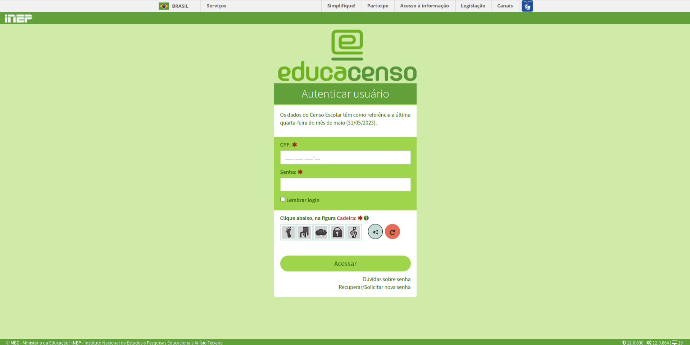
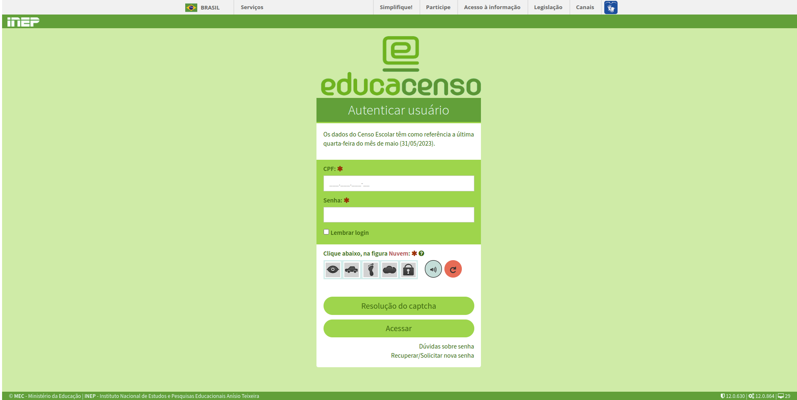

# Captcha solver inep educacenso

Este projeto visa contornar o CAPTCHA presente no portal Educacenso do INEP, para facilitar a automação de processos que envolvem a extração de dados do sistema.

## Estrutura do Projeto

```bash
.
├── console.js
├── keras_model.h5
├── labels.txt
├── main.py
├── palavras-chaves-encontradas.txt
├── requirements.txt
└── Tela-Login-Censo-Escolar-INEP-Instituto-Nacional-de-Estudos-e-Pesquisas.png
```

## Como usar

Rode o server em python e depois abra a tela de login, abra o console do navegado e cole o codigo presente no arquivo [console](./console.js)


### Requisitos

- Python 3.x
- TensorFlow 2.12
- Outras dependências listadas em `requirements.txt`

### Passos

1. Clone o repositório:

    ```bash
    git clone https://github.com/AugustoSavi/captcha-solver-inep-educacenso.git
    cd captcha-solver-inep-educacenso
    ```

2. Crie e ative um ambiente virtual:

    ```bash
    python -m venv myenv
    source myenv/bin/activate   # no Linux/Mac
    myenv\Scripts\activate      # no Windows
    ```

3. Instale as dependências:

    ```bash
    pip install -r requirements.txt
    ```

4. Execute o script Python:

    ```bash
    python main.py
    ```

5. Após a execução do script, o resultado estará disponível no arquivo `palavras-chaves-encontradas.txt`.

## Sobre a tela de login do Censo Escolar - INEP





A imagem acima mostra a tela de login do Censo Escolar do INEP. Este projeto visa contornar o CAPTCHA presente nessa tela para facilitar a automação de processos que envolvem a extração de dados do sistema.